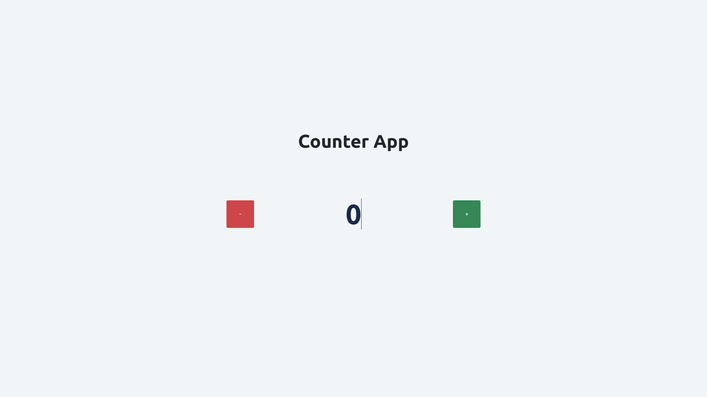

# Counter App

Klik gambar untuk video demo aplikasi.

Counter App merupakan sebuah aplikasi untuk melakukan perhitungan, dimana memiliki minimum value "0".
Jika angka yang ditampilkan "0", dan melakukan _subtract_ atau pengurangan maka akan menampilkan _message_ "Oops! you reach the min value!"

Terdapat beberpa variable dan function dengan masing-masing fungsi yang berbeda.

## Variable

- `number` = menangkap sebuah element untuk menyimpan dan menampilkan angka _counter_.
- `addbtn` = menangkap sebuah element untuk menambahkan angka _counter_.
- `subtractbtn` = menangkap sebuah element untuk mengurangi angka _counter_.
- `message` = menangkap sebuah element untuk menampilkan _message_.

## Function

- `addCounter` = function yang bertugas untuk melakukan penambahan angka _counter_
- `subtractCounter` = function yang bertugas untuk melakukan melakukan pengurangan angka _counter_. Jika angka yang ditampilkan "0", dan melakukan _subtract_ atau pengurangan maka akan menampilkan _message_ "Oops! you reach the min value!" selama 3 detik
- `clearMessage` = function yang bertugas untuk melakukan menghapus _message_ yang ditampilkan

## Submission

`grader-cli submit cypress/integration/dom/counter-app`