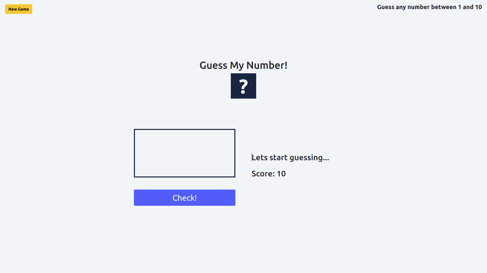

# Guess The Number

Klik gambar untuk video demo aplikasi.

Guess The Number merupakan sebuah permainan dimana pemain harus menebak sebuah secret number dari 1 - 10 dengan kriteria berikut:

- Setiap kali salah menebak maka score akan berkurang.
- Jika angka yang dimasukan diluar range 1 - 10 maka akan menampilkan _message_ "Guess any number between 1 and 10"
- Jika angka yang dimasukan **Benar** maka akan menampilkan _message_ "Yeay! you guessed it!" dan secret number akan ditampilkan.
- Jika angka yang dimasukan lebih kecil maka akan menampilkan _message_ "Too small, buddy!"
- Jika angka yang dimasukan lebih besar maka akan menampilkan _message_ "Oww... that's too big!"
- Jika Score1 dan angka yang dimasukan salah maka akan menampilkan _message_ "Oops, you lost the game"

Terdapat beberpa variable dan function dengan masing-masing fungsi yang berbeda.

## Variable

- `newGameBtn` = menangkap sebuah element untuk melakukan restart game
- `randomNumber` = menangkap sebuah element untuk generate random number dari 1 sampai 10
- `message` = menangkap sebuah element untuk untuk menampilkan _message_
- `displayScore` = menangkap sebuah element untuk untuk menampilkan score
- `input` = menangkap sebuah element untuk untuk memasukan data
- `checkBtn` = menangkap sebuah element untuk melakuan pengecekan angka pada input
- `score` = menangkap sebuah element untuk menampilkan score

## Function

- `displayMessage` = function yang bertugas untuk menampilkan _message_
- `resetGame` = function yang bertugas untuk merestart permainan. pada function ini message yang ditampilkan akan dikembalikan menjadi "Lets start guessing..." dan akan melakukan generate random number.
- `checkNumber` = function yang bertugas untuk melakukan pengecekan pada angka yang dimasukan

## Submission

`grader-cli submit cypress/integration/dom/guess-number-assignment`