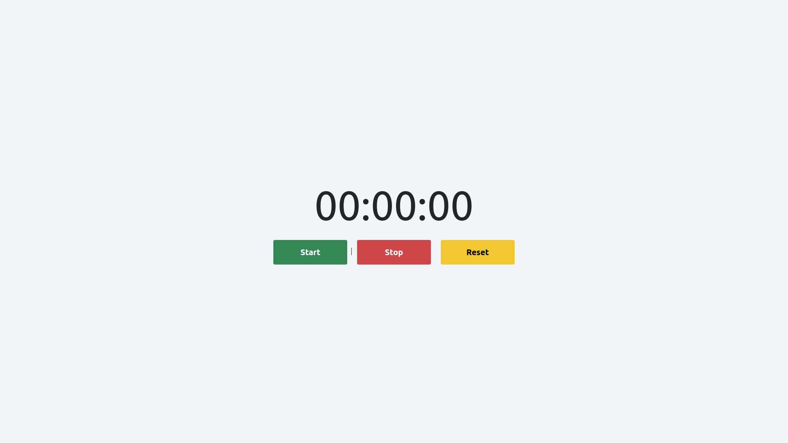

# Stop Watch App

Klik gambar untuk video demo aplikasi.

Stop Watch App merupakan sebuah aplikasi penghitung waktu.

Terdapat beberpa variable dan function dengan masing-masing fungsi yang berbeda.

## Variable

- `stopwatch` = menangkap sebuah element untuk mendapatkan value dari stopwatch
- `startbtn` = menangkap sebuah element untuk memulai stapwatch
- `stopbtn` = menangkap sebuah element untuk memberhentikan stopwatch
- `resetbtn` = menangkap sebuah element untuk mereset value dari stopwatch

## Function

- `start` = function yang bertugas untuk menjalankan stopwatch
- `stop` = function yang bertugas untuk memberhentikan stopwatch
- `reset` = function yang bertugas untuk mereset waktu stopwatch
- `runTime` = function yang bertugas untuk menambahkan waktu ketika function `start` dijalankan.

## Submission

`grader-cli submit cypress/integration/dom/stopwatch-app-assignment`