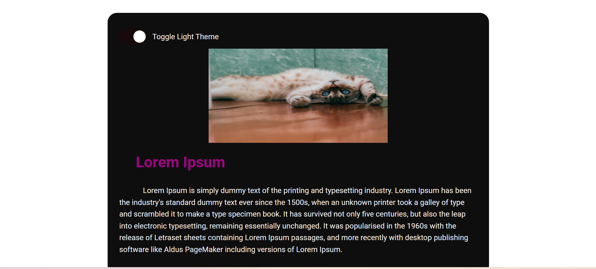
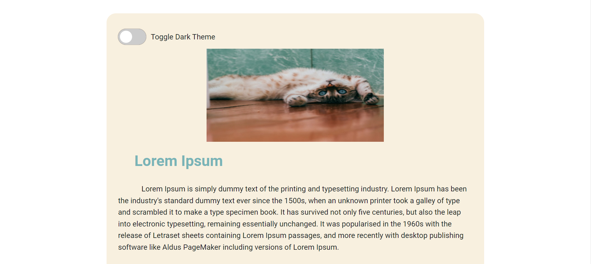

# Penjelasan Aplikasi

Dalam aplikasi ini terdapat artikel dimana user dapat mengubah tema dari aplikasi.

## Tujuan Aplikasi

Tujuan kalian sekarang ialah membuat aplikasi ini dapat berubah menjadi tema gelap dan terang dengan mengisikan baris kosong beginanswer dan endanswer

## Panduan

1. Sudah disiapkan styles['light-theme'] dan styles['dark-theme'] pada setiap file module.scss untuk mengubah warna dari component tersebut.

2. Method renderTheme pada file src/Components/Container.js
   berisikan fungsi untuk mengubah warna container

3. Method renderTheme pada file src/Components/Header.js
   berisikan fungsi untuk mengubah warna container

4. Method changeTheme pada file src/Components/ToggleButton.js
   berisikan fungsi untuk mengubah tema dari aplikasi

5. Method renderToggleButtonText pada file src/Components/ToggleButton.js
   berisikan fungsi untuk mengubah warna dari toggle button

## Gambaran Aplikasi

.

.

## Hint

## Cara menjalankan project

1. npm install
2. npm run start
3. buka localhost:3000 pada browser anda

## Cara menjalankan file test

1. npm run test
