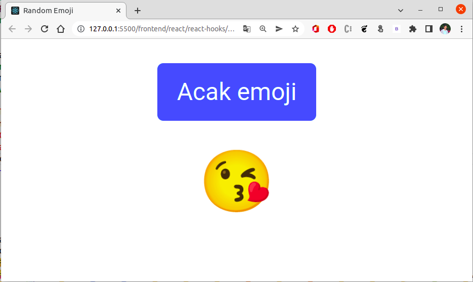

# Random Emoji

Kita tahu, bahwa saat ini emoji sangat populer. Hampir semua aplikasi sosial media, blog, dan website menggunakan emoji untuk menyampaikan informasi bisa berupa perasaan, atau simbol yang mendeskripsikan.

Pak Asrul adalah seorang penulis blog yang sangat menyukai emoji. Namun, saat ini ia sangat sibuk dengan tugasnya bahkan terkadang ia sering merasa lelah dan stress. Sehingga ia tidak bisa menulis blog yang menarik lagi. Setelah digali informasi tentang pak Asrul dari teman-temannya, didapatkan bahwa pak Asrul "Se-stress apapun akan dapat kembali bersemangat ketika melihat emoji yang menarik".

Agar pak Asrul bisa menulis blog yang menarik lagi, bantulah ia dengan membuatkan sebuah web yang sederhana yang dapat menampilkan emoji secara random.

## Konsep web
- Membuat sebuah web yang menampilkan emoji secara random
- Emoji akan bergantian ketika sebuah tombol di klik
- Web yang dibangun menggunakan react hooks

## Hasil yang diharapkan

