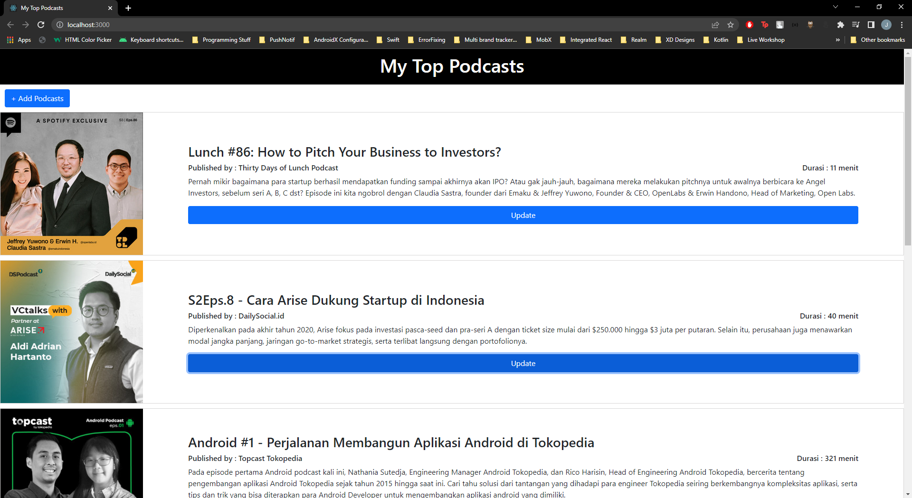
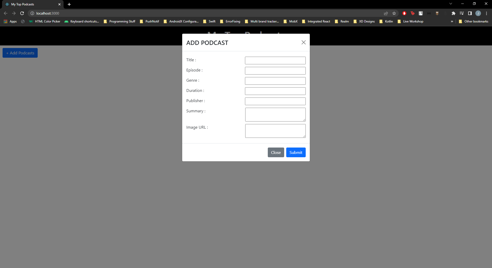
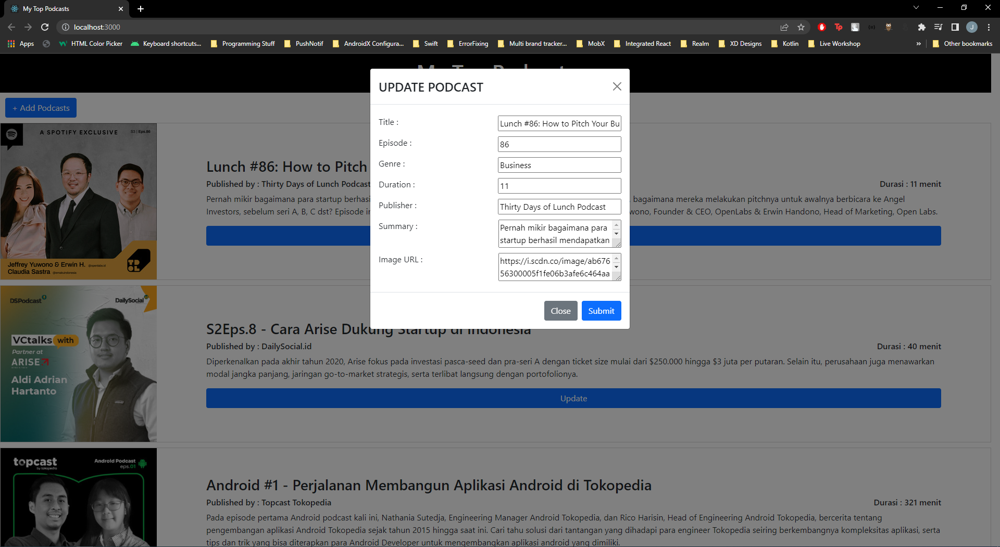

# My Top Podcasts

Podcasts adalah salah satu media yang cukup digemari semua kalangan akhir-akhir ini. Disamping dapat menjadi selingan saat melakukan kegiatan WFH maupun kelas online, Podcasts juga dapat menambah wawasan dan produktivitas.

Website "My Top Podcasts" ini akan menampilkan daftar podcast terfavorit. List podcast dari website ini dapat ditambahkan dan di update oleh semua yang mengaksesnya

## Objective
* Mendapatkan / fetching data podcasts dari API berikut : https://62694140f2c0cdabac0bc516.mockapi.io/podcasts/api/Podcasts dengan method **GET**
* Menampilkan data podcasts list ke dalam component PodcastListItem
* Menampilkan pop up (modal) saat user menekan tombol "Add Podcast" ataupun "Update"
* Apabila user mengisi form "Add Podcast" dan menekan tombol "Submit" maka akan melakukan fetching dengan method **POST**
* Apabila user menampilkan form update, maka akan menampilkan data dari podcast yang dipilih.
* Apabila user mengisi form "Update Podcast" dan menekan tombol "Submit" maka akan melakukan fetching dengan method **PUT**

## Hasil yang Diharapkan

