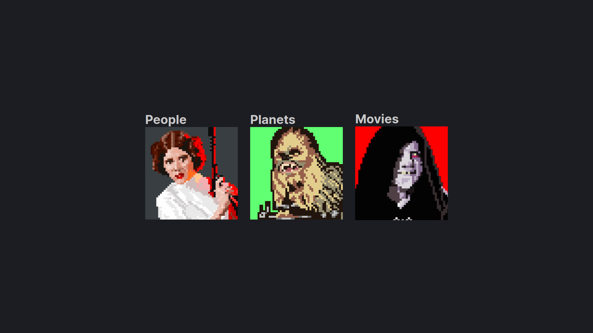
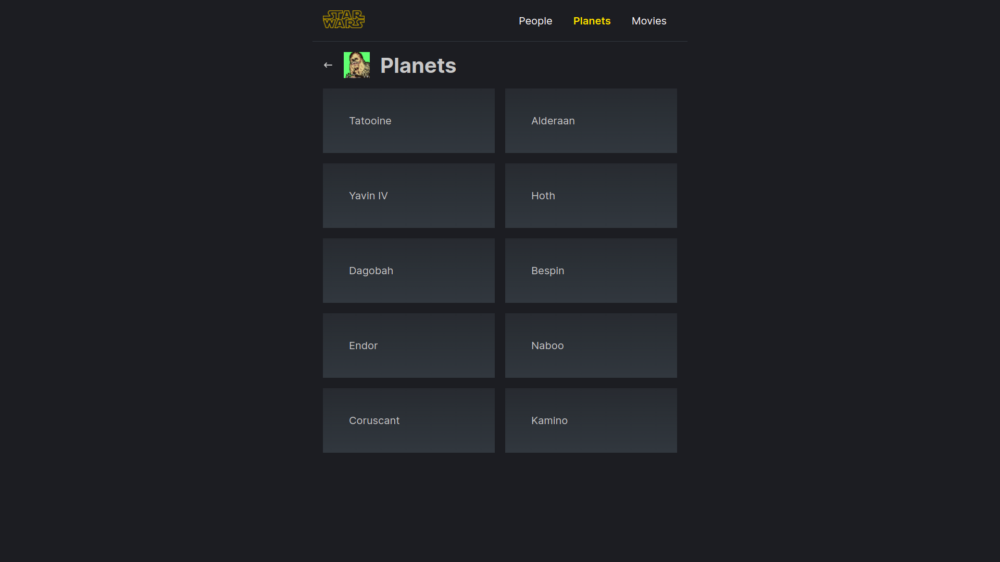
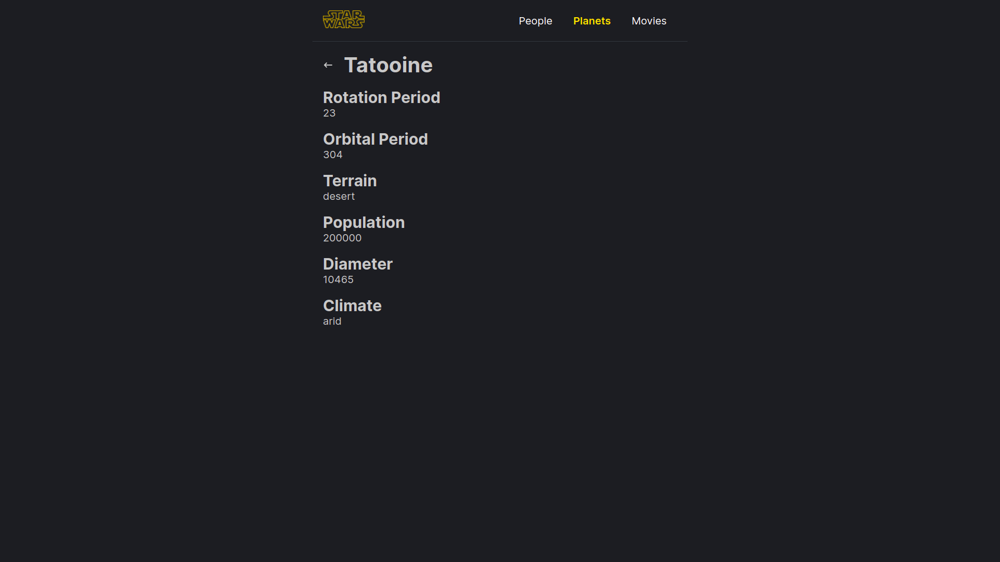
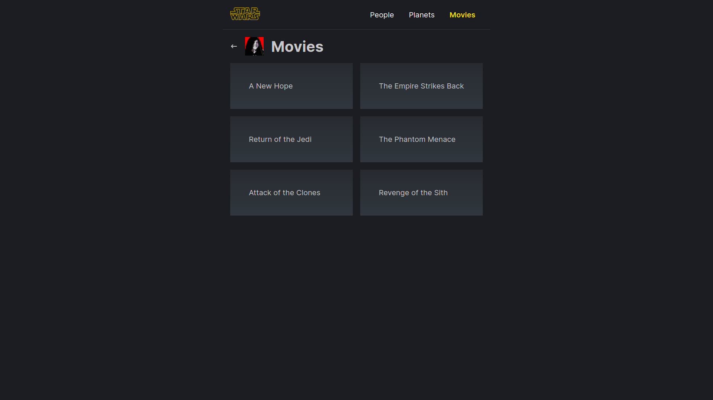
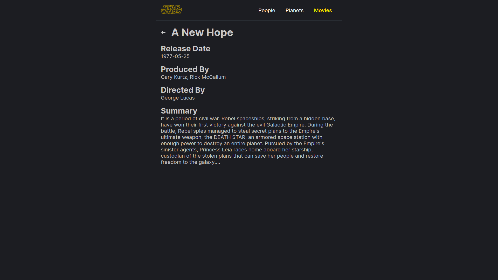

# Nested Routes CP

Website atau aplikasi yang kompleks memiliki sistem routing yang bersarang (nested). Kali ini, walaupun belum terlalu kompleks, kalian diminta untuk membuat sebuah aplikasi yang mengimplementasikan nested routing, mengarahkan perpindahan halaman, serta memanfaatkan URL param

Menggunakan API dari swapi.com aplikasi ini dapat mengambil & menampilkan info-info yang berkaitan dengan franchise film Star Wars.

## Steps to Run

1. Navigate to `2-nested-routes-cp` directory
2. Run `npm install`
3. Run `npm start`

## Konsep Web

- Membuat sebuah web yang menampilkan
  - Menu People yang berisi karakter-karakter Star Wars
  - Menu Planets yang berisi planet-planet dalam Star Wars
  - Menu Movies yang berisi film-film Star Wars
- Tiap menu memiliki halaman detail yang berisi informasi lebih lanjut mengenai _item_ yang diklik

## Hasil yang diharapkan

- /star-wars
  
- /star-wars/planets
  
- /star-wars/planets/:id
  
- /star-wars/planets
  
- /star-wars/planets
  