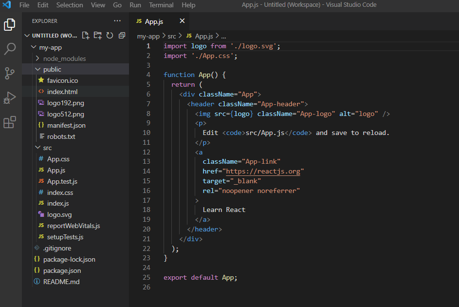
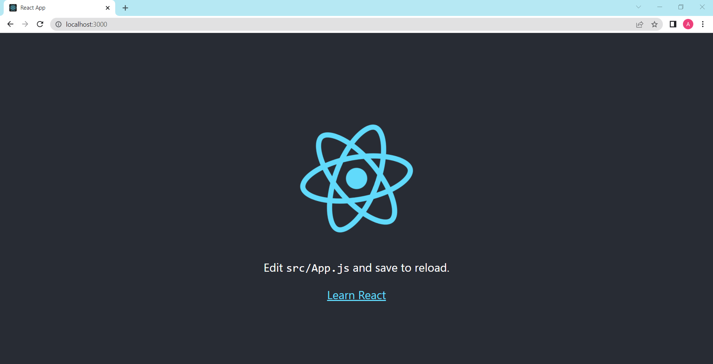

# DEMO 2 - Buat project React menggunakan Create React App

Demo ini adalah demo untuk membuat project react dari awal dengan menggunakan create-react-app.

## Menggunakan Create React App

1. Kita akan membuat project baru dengan menggunakan create-react-app. Silahkan pertama-tama buat folder baru pada lokal kalian misalnya **demo-create-react-app**

```shell
contoh: D:\LEARNING\RUANGGURU> mkdir demo-create-react-app
```

2. Masuk ke folder **demo-create-react-app** yang telah kamu buat

```shell
contoh: D:\LEARNING\RUANGGURU> cd demo-create-react-app
```

3. Selanjutnya Untuk menginstall create react app, silahkan pilih opsi di bawah ini untuk membuat project dengan menggunakan `create-react-app`

- **opsi 1** - Kamu bisa menggunakan npx. NPX adalah Node Package Runner. Fungsinya untuk mengeksekusi package Nodejs. Apabila menggunakan npx, kita tidak perlu menginstall `create-react-app` terlebih dulu, kita bisa langsung buat projectnya dengan cara mengetikkan perintah `npx create-react-app <nama-project>`

```shell
contoh: D:\LEARNING\RUANGGURU> npx create-react-app my-app

```

- **opsi 2** - Apabila kamu tidak menggunakan **npx** kamu harus terlebih dulu menginstall program `create-react-app` untuk keperluan membuat sebuah project react yang baru. Apabila sudah selesai menginstall selanjutnya untuk membuat project baru ketikkan perintah `create-react-app <nama-project>`

```shell
contoh: D:\LEARNING\RUANGGURU> npm install -g create-react-app
contoh: D:\LEARNING\RUANGGURU> create-react-app my-app

```

4. Masuk ke folder **my-app** untuk melihat project yang telah dibuat

```shell
D:\LEARNING\RUANGGURU\demo-create-react-app> cd my-app
D:\LEARNING\RUANGGURU\demo-create-react-app> ls
```

- Berikut gambaran project jika membuka nya lewat vscode. Maka akan ada folder baru sesuai dengan nama project yang kita buat menggunakan `create-react-app` tadi



_Gambar 1 Struktur project yang dibuat dengan create react app_

- node_modules berisi paket-paket modul Nodejs; semua libaray yang kita install dengan npm akan disimpan di sini.
- 📁 **public** berisi file untuk publik seperti HTML, CSS, icon, dan gambar, dan aset publik lainnya;
  - 📄 **index.html** adalah file HTML yang akan digunakan aplikasi React untuk render komponen.
- 📁 **src** berisi kode dari aplikasi Reactjs, di sinilah kita akan membuat komponen;
  - 📄 **App.js** berisi kode untuk komponen App atau komponen utama dari aplikasi;
  - 📄 **App.test.js** berisi kode untuk testing komponen App;
  - 📄 **index.js** berisi kode untuk render komponen App ke Real DOM;
  - 📄 **serviceWorker.js** berisi kode untuk service worker, ini kita butuhkan nanti saat membuat aplikasi PWA (Progressive Web Apps);
  - 📄 **setTests.js** berisi kode untuk testing aplikasi.
  - 📄 **.gitignore** berisi kode-kode yang akan diabaikan oleh Git.
  - 📄 **package.json** file JSON yang berisi keterangan proyek dan daftar modul-modul yang dibutuhkan.
  - 📄 **package-lock.json** adalah file yang digunakan Yarn untuk mengunci versi-versi modul Nodejs yang digunakan.

5. Untuk menjalankan project React kita, kita hanya perlu menjalankan perintah berikut

```shell
D:\LEARNING\RUANGGURU\demo-create-react-app> npm start
```

Berikut tampilan project awal ketika menjalankan perintah `npm start`



_Gambar 2 Tampilan awal project yang dibuat dengan create react app_
