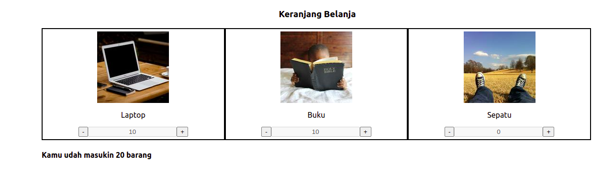

# Keranjang Belanja

Keranjang Belanja merupakan sebuah aplikasi sederhana untuk menghitung jumlah belanjaan yang kita miliki.

Kalian diminta untuk membuat sebuah aplikasi yang dapat mengitung jumlah total dari masing-masih item yang dibelanjakan.

## Konsep web
- Membuat sebuah web yang menampilkan jumlah item yang akan dibeli.
- Setiap kali item ditambahkan maka total item akan otomatis bertambah.
- Jumlah maksimum dari masing-masing item adalah 10, dan jika jumlah sudah 10 dan ingin menambahkan maka akan menampilkan alert "Ups, udah kelebihan yaa".
- Jumlah minumum untuk masing-masing item 0.

## Hasil yang diharapkan

